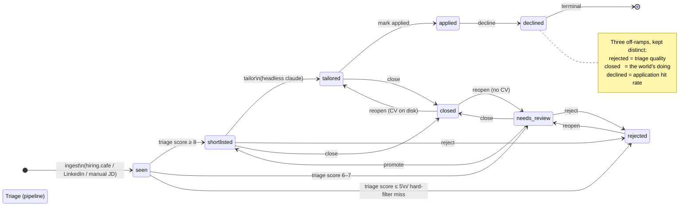

# Job status lifecycle

The canonical status set lives in `dashboard/src/jobs_dashboard/db.py`
(`STATUS_ORDER` + `ACTIONS`); the `scripts/promote.sh` verbs and the
`CHECK` constraint in `scripts/schema.sql` mirror it. Triage thresholds are
defined in `tooling/TRIAGE.md`. This diagram is the human-readable summary —
keep it in sync when the transition table changes.

> Mermaid renders `needs_review` without the hyphen; the real status string is
> `needs-review`.

## Transition table

| From | Action / step | To | Where |
|------|---------------|----|-------|
| _(none)_ | ingest | `seen` | `scripts/ingest.sh`, `/ingest-*` |
| `seen` | triage ≥ 8 | `shortlisted` | pipeline (`tooling/TRIAGE.md`) |
| `seen` | triage 6–7 | `needs-review` | pipeline |
| `seen` | triage ≤ 5 / hard filter | `rejected` | pipeline |
| `needs-review` | promote | `shortlisted` | dashboard / `promote.sh` |
| `needs-review`, `shortlisted`, `seen` | reject | `rejected` | dashboard / `promote.sh reject` |
| `needs-review`, `shortlisted`, `tailored` | close | `closed` | dashboard / `promote.sh close` |
| `shortlisted` | tailor | `tailored` | `scripts/tailor-*.sh` |
| `tailored` | mark applied | `applied` | dashboard |
| `applied` | decline | `declined` | dashboard / `promote.sh decline` |
| `rejected`, `closed` | reopen | `needs-review` | dashboard |
| `closed` **with a CV on disk** | reopen | `tailored` | dashboard (special-cased) |

## Notes

- **`seen`** is transient: the pipeline must drain it to zero every run, so a
  job never lingers there between runs.
- **Three off-ramps** (`rejected`, `closed`, `declined`) are deliberately not
  merged — each answers a different question, so collapsing any pair would make
  its bucket unreadable. `rejected` measures triage quality, `closed` is the
  posting being retired by the world, and `declined` against `applied` is your
  application hit rate.
- **`declined` is terminal**: you already applied, so there's no earlier stage
  to reopen to. It's reachable only from `applied`.
- **Reopen is CV-aware**: reopening a `closed` job that still carries a tailored
  CV restores `tailored` (the artifact survives); otherwise it returns to
  `needs-review`. Reopening a `rejected` job always returns to `needs-review`.
- The legacy `triaged` status is still accepted by the schema `CHECK` for
  backward compatibility but nothing writes it anymore.
